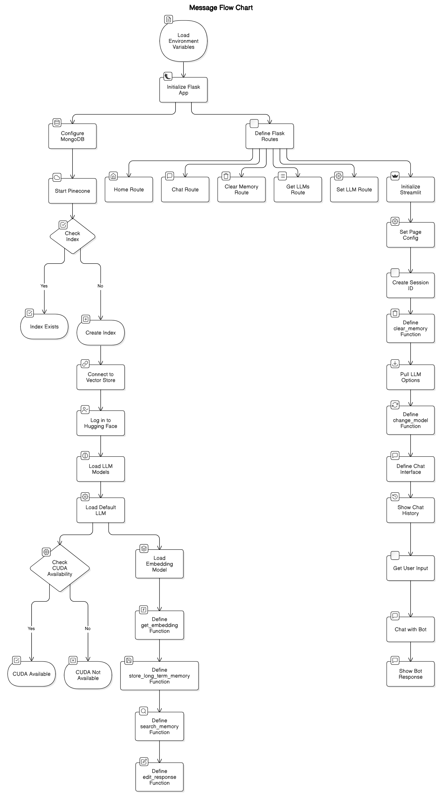

# Jetbot - AI-Powered Conversational Chatbot

## Overview

Jetbot is an advanced AI chatbot designed for the Jetlink project, leveraging cutting-edge language models from Hugging Face and an efficient memory system powered by Pinecone and MongoDB. It provides a seamless conversational experience with both short-term and long-term memory retention, ensuring context-aware responses across user interactions.

## Features

### 🤖 Intelligent Conversational AI

- Uses **LLAMA-3 models** from Hugging Face for accurate and contextual responses.
- Supports **multiple model selections** for flexibility.

### 🔖 Advanced Memory System

- **Short-term memory** (session-based): Ensures smooth, context-aware conversation flow within a session.
- **Long-term memory** (persistent): Stores user interactions in MongoDB for personalized responses across sessions.
- **Vector Search with Pinecone**: Enhances retrieval efficiency for relevant past interactions.

### 🌐 Streamlit-Powered Frontend

- **User-friendly UI** with a sleek chat interface.
- **Easy memory management** (clear session & long-term memory with one click).
- **Model switching on demand** for experimentation with different AI models.

### 🛠️ Robust Backend with Flask

- **Efficient API endpoints** for processing user messages.
- **MongoDB for persistent storage** and user data retention.
- **Session handling**.

## Project Structure

The project directory is structured as follows:

```
Jetlink-Case-Study/
│
├── app.py              # Streamlit frontend application file
├── chatbot_api.py      # Flask backend API for chatbot functionality
├── requirements.txt    # Python dependencies
└── README.md           # Project documentation
```

## Workflow Overview

### Frontend (Streamlit)

- **Streamlit** provides an interactive UI where users can chat with the bot, change models, and clear memory.
- Users can interact with the bot in real-time and manage memory and model settings via buttons.


### Backend (Flask-based API)

- **Flask** handles user inputs and delivers bot responses via REST API endpoints.
- **MongoDB** is used for long-term memory, storing persistent user interactions across sessions.
- **Pinecone** is used for short-term memory within a session, leveraging vector embeddings for quick retrieval of relevant context. (Pinecone has been used for both short-term and long-term memory at some point.)
- **Hugging Face Models** are used for generating responses to user queries (e.g., LLAMA-3 models).
- **Session-based Memory** is managed by Flask sessions for short-term interaction context.



## Installation & Setup

Follow the steps below to set up the environment and install dependencies:

1. **Clone the Repository:**

   ```sh
   git clone <repository-url>
   cd Jetlink-Case-Study
   ```

2. **Create & Activate a virtual environment:**

   ```sh
   python -m venv jet_env
   ```

   - On **Windows**:
     ```sh
     .\jet_env\Scripts\activate
     ```
   - On **macOS/Linux**:
     ```sh
     source jet_env/bin/activate
     ```

3. **Install the dependencies**:

   ```sh
   pip install -r requirements.txt
   ```

4. **Set Up MongoDB:**

   MongoDB stores chat history and related data. Follow these instructions:

   - Install MongoDB: [MongoDB Installation Guide](https://www.mongodb.com/docs/manual/installation/).
   - Start MongoDB:
     - **Windows/macOS**: MongoDB should start automatically after installation. If not, use:
       ```bash
       mongod
       ```
     - **Linux**: Start MongoDB with:
       ```bash
       sudo systemctl start mongod
       ```

5. **Set Up Pinecone Account:**

   - Create a Pinecone account at [Pinecone.io](https://www.pinecone.io/).
   - Obtain your API key from Pinecone.

6. **Set Up Environment Variables:**

   Create a `.env` file in the root directory with the following variables:

   ```sh
   FLASK_SECRET_KEY="your_secret_key"
   MONGO_URI="mongodb://localhost:27017/chatbotDB"
   PINECONE_API_KEY="your_pinecone_api_key"
   HUGGING_FACE_TOKEN="your_huggingface_api_token"
   ```

   **Tip:** Generate your own `FLASK_SECRET_KEY` with the following code:

   ```python
   import secrets
   print(secrets.token_hex(32))
   ```

## Running the Application

1. **Start the Flask API:**

   In a terminal, activate the virtual environment and run the Flask API:

   ```sh
   python chatbot_api.py
   ```

2. **Launch the Streamlit Interface:**

   In another terminal, run the Streamlit app:

   ```sh
   streamlit run app.py
   ```

   The chatbot UI will open in your browser.

## Usage

### 🎭 Interactive UI

- **Chat with Jetbot** in real-time.
- **Switch between AI models** to compare responses.
- **Clear Memory** whenever needed.


### 🔒 Memory Management

- **Session-based memory** persists during active interactions.
- **Long-term memory** ensures personalization across multiple sessions.
- **Clear history easily** via the UI buttons.

### 🌎 Model Customization

- Modify Hugging Face models based on the use case.
- Expand or fine-tune new models for better performance.

---

## Technical Highlights

### 🚀 Optimized Memory Retrieval

- Uses **vector-based search** with Pinecone for fast and relevant memory retrieval.
- Ensures **low latency** for efficient chatbot interactions.

### 🛡️ Secure & Scalable Architecture

- Built with **Flask** for backend API services.
- Uses **MongoDB for structured data storage**.
- Supports **future cloud deployment** (Docker/AWS/GCP ready).

---
